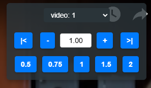

# Media Speed Bookmarklet
Simple bookmarklet to control html video and audio speed.

## Motivation

I didn't like the red colour scheme of the original version and wanted bigger buttons and a custom number entry. The Sliding bar was confusing.

### Features
* Ability to set the playback speed for every audio or video element on the page
* Ability to skip to the end of a piece of media. This skips ads too
* Ability to go back to the beginning
* Ability to enter a speed manually into the text box
* Ability to increment speed up or down by 0.1
* New UI
* Removed slide bar in favour of text box only which can take manual input and update in real time to show current speed

## Installation

1. Go to this page https://caiorss.github.io/bookmarklet-maker/
2. Give it a title
3. Copy the contents of index.js into the `Code` text area
4. You may want to remove the //comments for code cleanliness purposes
5. Click the "Generate Bookmarklet" button
6. Drag that blue link to your bookmarks bar
### Usage

1. Go to a webpage with audio or video, or both, elements
2. Click on the bookmarklet you just created
3. Choose the audio or video from the drop-down that you want to speed up or slow down
4. Slide the slider to change the media's speed
5. Enjoy

## Development

I tweaked the original version to better suit my own needs and prettify it.

## License

MIT
